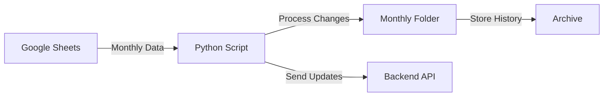

# Google Sheets Attendance Sync

## Overview

The Google Sheets Attendance Sync is an automated Python system that synchronizes employee attendance data from Google Sheets to your backend system. It ensures efficient processing by only handling updated records and maintaining organized monthly archives.

## Features

- 🔄 Automated monthly attendance data synchronization
- 📊 Smart change detection to process only updated records
- 📁 Organized monthly storage with timestamped files
- 🔐 Secure Google Sheets API integration
- 📤 Automated API communication for data updates

## System Architecture

### 1. Data Flow



### 2. Folder Structure

```
attendance/
├── attendance_May_25/
│   ├── attendance_25-May-2024_02-30-45-PM.csv
│   └── output_May_25.csv
├── attendance_Jun_25/
│   └── ...
└── ...
```

## Setup & Configuration

### Prerequisites

- Python 3.x
- Google Cloud Project with Sheets API enabled
- Service account credentials
- Backend API endpoint access

### Environment Variables

Create a `.env` file with the following variables:

```env
GOOGLE_CREDENTIALS_FILE=path/to/service-account.json
SPREADSHEET_KEY=your-spreadsheet-id
```

### Installation

1. Install required packages:
```bash
pip install python-dotenv google-api-python-client pandas requests
```

2. Set up Google Cloud credentials:
   - Create a service account in Google Cloud Console
   - Download the JSON credentials file
   - Enable Google Sheets API for your project

## Core Components

### 1. Worksheet Processing

The system processes worksheets named in the format "Month-YY" (e.g., "May-25", "MAY-25").

#### Worksheet Filtering Logic
```python
attendance_worksheets = [
    ws for ws in worksheets 
    if any(ws.title.startswith(month) for month in month_list) 
    and '-' in ws.title
]
```

### 2. Change Detection

The system implements a sophisticated change detection mechanism:

1. **Data Extraction**
   - Retrieves all values from the worksheet
   - Processes data into a structured format

2. **Change Analysis**
   - Compares current data with the most recent previous CSV
   - Identifies new or modified employee records
   - Generates an output file only for changed records

### 3. API Integration

The system communicates with the backend API using multipart form data:

- **Endpoint**: `http://192.168.0.200:8080/api/attendance/upload`
- **Method**: POST
- **Payload**:
  - `file`: CSV file containing attendance data
  - `month`: Month name (e.g., "May")
  - `year`: Year (e.g., "2025")

## Workflow

1. **Data Collection**
   - Connects to Google Sheets using service account credentials
   - Downloads monthly attendance data

2. **Processing**
   - Creates month-specific folder structure
   - Saves current data with timestamp
   - Compares with previous data

3. **Change Management**
   - If changes detected:
     - Saves updated records to output file
     - Sends data to API
   - If no changes:
     - Deletes current file to save space

4. **Archiving**
   - Maintains organized monthly folders
   - Stores historical data for reference

## Error Handling

The system includes robust error handling for:
- API connection issues
- Google Sheets API rate limits
- File system operations
- Data validation

## Maintenance

### Regular Tasks

1. **Monthly Review**
   - Verify successful data synchronization
   - Check API response logs
   - Validate folder structure

2. **Archive Management**
   - Monitor storage space
   - Implement retention policies
   - Backup critical data

## Security Considerations

- Service account credentials are stored securely
- API endpoints are protected
- Data transmission is encrypted
- Access is restricted to authorized personnel

## Troubleshooting

### Common Issues

1. **API Connection Failures**
   - Verify network connectivity
   - Check API endpoint availability
   - Validate credentials

2. **Data Sync Issues**
   - Verify Google Sheets permissions
   - Check worksheet naming conventions
   - Validate data format

## Support

For technical support or questions, contact:
- System Administrator
- IT Support Team
- Development Team

---

*Last Updated: [Current Date]*
