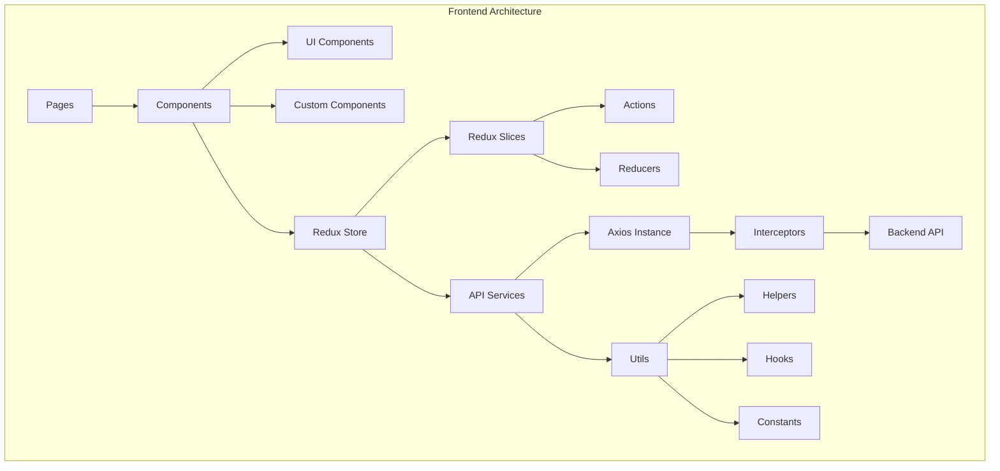
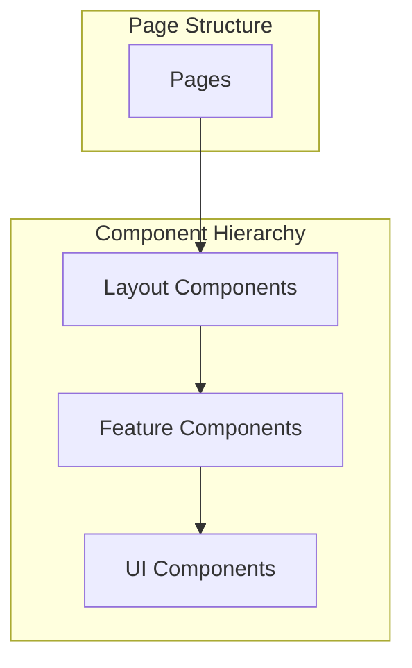
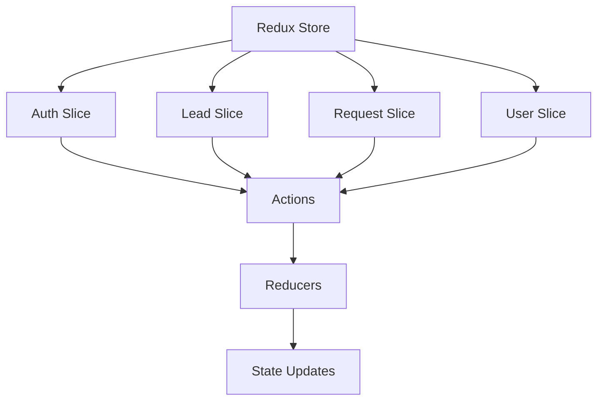
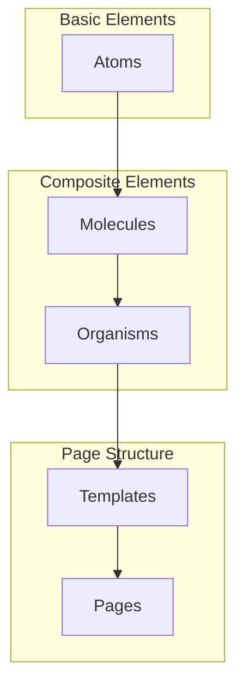
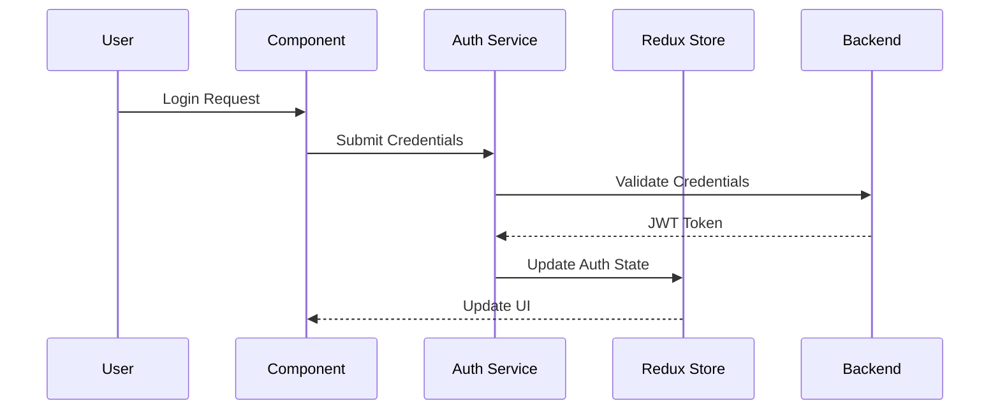

# 🏥 MedhirWeb Frontend Documentation & Architecture

## 📚 Table of Contents
- [System Overview](#system-overview)
- [Architecture Layers](#architecture-layers)
- [User Roles & Pages](#user-roles--pages)
- [Component System](#component-system)
- [State Management](#state-management)
- [API Integration](#api-integration)
- [Authentication & Security](#authentication--security)
- [Performance & Optimization](#performance--optimization)
- [Development Standards](#development-standards)

## 🌟 System Overview

MedhirWeb is a comprehensive healthcare management system built with Next.js, featuring a role-based access control system and modern frontend architecture.



## 📦 Architecture Layers

### 1. Presentation Layer


### 2. State Management Layer


## 👥 User Roles & Pages

### 1. Superadmin
| Page | Description | Components | Features |
|------|-------------|------------|----------|
| `superadmin/dashboard` | Admin overview | `DashboardCard`, `PendingRequestsCard` | - System statistics<br>- Pending requests<br>- Quick actions<br>- Activity logs |
| `superadmin/companies` | Company management | `CompanyList`, `AddCompanyModal` | - Company CRUD<br>- Employee assignment<br>- Company settings<br>- Billing management |
| `superadmin/employees` | Employee management | `EmployeeList`, `AddEmployeeModal` | - Employee CRUD<br>- Role assignment<br>- Access control<br>- Performance tracking |

### 2. HR Admin
| Page | Description | Components | Features |
|------|-------------|------------|----------|
| `hradmin/dashboard` | HR overview | `DashboardCard`, `EmployeeStats` | - Employee statistics<br>- Department overview<br>- Recruitment metrics<br>- HR analytics |
| `hradmin/leads` | Lead management | `LeadManagement`, `ConvertLeadModal` | - Lead tracking<br>- Conversion management<br>- Follow-up system<br>- Lead analytics |
| `hradmin/requests` | Request handling | `RequestDetails`, `RequestTable` | - Request processing<br>- Status tracking<br>- Approval workflow<br>- Request history |

### 3. Manager
| Page | Description | Components | Features |
|------|-------------|------------|----------|
| `manager/dashboard` | Manager overview | `TeamStats`, `TaskList` | - Team performance<br>- Task management<br>- Resource allocation<br>- Progress tracking |
| `manager/team` | Team management | `TeamList`, `PerformanceMetrics` | - Team overview<br>- Performance tracking<br>- Resource management<br>- Team analytics |

### 4. Employee
| Page | Description | Components | Features |
|------|-------------|------------|----------|
| `employee/dashboard` | Employee overview | `TaskList`, `PerformanceCard` | - Task overview<br>- Performance metrics<br>- Upcoming deadlines<br>- Quick actions |
| `employee/profile` | Profile management | `ProfileForm`, `DocumentUpload` | - Profile editing<br>- Document management<br>- Skills tracking<br>- Career goals |

## 🎨 Component System

### 1. Atomic Design Implementation


### 2. Component Categories

#### Atoms
- Buttons
- Inputs
- Icons
- Typography

#### Molecules
- Form Groups
- Search Bars
- Navigation Items
- Cards

#### Organisms
- Headers
- Sidebars
- Forms
- Tables

#### Templates
- Page Layouts
- Grid Systems
- Content Structures

#### Pages
- Complete Views
- Route Handlers
- Data Fetching

## 🔄 State Management

### 1. Redux Store Structure
```javascript
// Store Configuration
const store = configureStore({
  reducer: {
    auth: authReducer,
    leads: leadsReducer,
    requests: requestsReducer,
    user: userReducer
  },
  middleware: (getDefaultMiddleware) =>
    getDefaultMiddleware().concat(apiMiddleware)
});
```

### 2. Slice Pattern
```javascript
// Example Slice
const leadSlice = createSlice({
  name: 'leads',
  initialState: {
    items: [],
    loading: false,
    error: null
  },
  reducers: {
    // Synchronous reducers
  },
  extraReducers: (builder) => {
    // Async reducers
  }
});
```

## 📡 API Integration

### 1. Service Layer
```javascript
// API Service Structure
class ApiService {
  constructor() {
    this.api = axios.create({
      baseURL: process.env.NEXT_PUBLIC_API_URL,
      timeout: 10000
    });
    
    this.setupInterceptors();
  }
  
  setupInterceptors() {
    // Request/Response interceptors
  }
}
```

### 2. Error Handling
```javascript
// Error Handler
const errorHandler = {
  handle: (error) => {
    if (error.response) {
      switch (error.response.status) {
        case 401:
          // Handle unauthorized
          break;
        case 403:
          // Handle forbidden
          break;
        default:
          // Handle other errors
      }
    }
  }
};
```

## 🔐 Authentication & Security

### 1. Auth Flow


### 2. Security Features
- JWT-based authentication
- Role-based access control
- Session management
- Password encryption
- CSRF protection
- XSS prevention

## ⚡ Performance & Optimization

### 1. Code Splitting
```javascript
// Dynamic Imports
const DynamicComponent = dynamic(() => import('./Component'), {
  loading: () => <LoadingSpinner />,
  ssr: false
});
```

### 2. Caching Strategy
```javascript
// Cache Service
const cacheService = {
  set: (key, value, ttl) => {
    // Cache implementation
  },
  get: (key) => {
    // Cache retrieval
  },
  invalidate: (key) => {
    // Cache invalidation
  }
};
```

## 🎨 UI/UX Design System

### 1. Color System
```css
/* Primary Colors */
--primary-100: #E6F0FF;
--primary-500: #007bff;
--primary-900: #004999;

/* Secondary Colors */
--secondary-100: #F8F9FA;
--secondary-500: #6c757d;
--secondary-900: #343A40;

/* Status Colors */
--success: #28a745;
--danger: #dc3545;
--warning: #ffc107;
--info: #17a2b8;
```

### 2. Typography System
```css
/* Font Families */
--font-heading: 'Inter', sans-serif;
--font-body: 'Roboto', sans-serif;
--font-mono: 'Fira Code', monospace;

/* Font Sizes */
--text-xs: 0.75rem;
--text-sm: 0.875rem;
--text-base: 1rem;
--text-lg: 1.125rem;
--text-xl: 1.25rem;
--text-2xl: 1.5rem;
```

## 🔧 Development Standards

### 1. Project Structure
```
src/
├── components/
│   ├── atoms/
│   ├── molecules/
│   ├── organisms/
│   └── templates/
├── pages/
│   ├── api/
│   ├── auth/
│   ├── dashboard/
│   └── settings/
├── services/
│   ├── api/
│   └── utils/
├── store/
│   ├── slices/
│   └── middleware/
└── styles/
    ├── components/
    └── themes/
```

### 2. Code Standards
- ESLint configuration
- Prettier formatting
- TypeScript usage
- Component documentation
- Test coverage
- Git workflow

## 📱 Responsive Design

### 1. Breakpoint System
```css
/* Breakpoints */
--breakpoint-sm: 640px;   /* Mobile */
--breakpoint-md: 768px;   /* Tablet */
--breakpoint-lg: 1024px;  /* Laptop */
--breakpoint-xl: 1280px;  /* Desktop */
--breakpoint-2xl: 1536px; /* Large Desktop */
```

### 2. Mobile-First Approach
- Base styles for mobile
- Media queries for larger screens
- Flexible grid system
- Responsive images
- Touch-friendly interfaces
- Performance optimization

## 📈 Monitoring & Analytics

### 1. Error Tracking
```javascript
// Error Boundary
class ErrorBoundary extends React.Component {
  componentDidCatch(error, errorInfo) {
    // Log error to monitoring service
  }
  
  render() {
    // Error UI
  }
}
```

### 2. Performance Monitoring
```javascript
// Performance Metrics
const performanceMetrics = {
  trackPageLoad: () => {
    // Track page load time
  },
  trackApiCalls: () => {
    // Track API performance
  },
  trackUserInteractions: () => {
    // Track user interactions
  }
};
```
